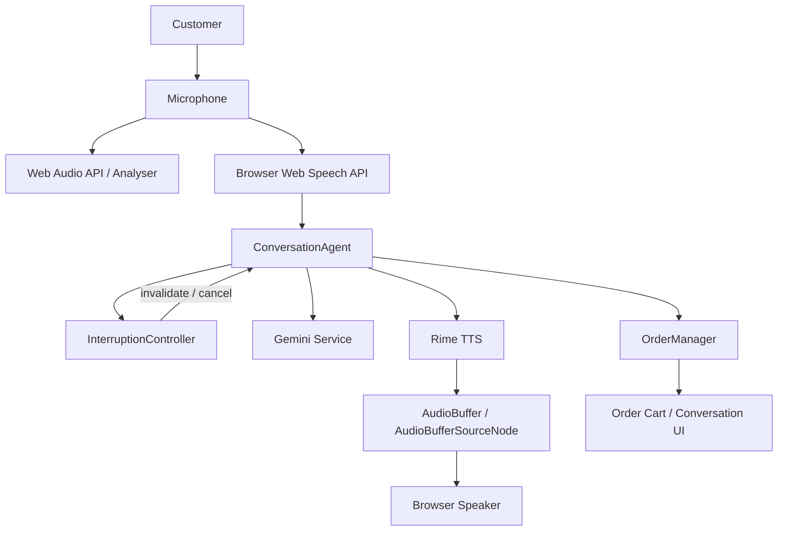

# VocaBite

**Voice-first restaurant ordering with interruption-aware conversation and order recovery.**

VocaBite is a web application that lets customers build and modify a restaurant order using natural speech. Its central voice-engineering challenge is **interruption and recovery**: a customer can speak over the assistant, correct an earlier request, and have the newer instruction take priority without obsolete assistant audio continuing to play or stale responses overwriting the active turn.

## 🎯 Problem

Restaurant ordering is often a multi-step interaction. Customers may change their mind while an assistant is speaking:

> “Add a chicken biryani.”
>
> *Assistant starts responding…*
>
> “Wait, make the biryani less spicy.”

A voice interface that makes the customer wait for the assistant to finish speaking creates friction. The harder problem is not simply detecting speech; it is **recovering conversation state after an interruption** while keeping the order consistent.

VocaBite addresses this by combining browser speech recognition, an interruption controller, Gemini-based order understanding, an explicit order manager, Rime TTS, and browser Web Audio playback.

## 💡 Solution

VocaBite coordinates the complete voice ordering loop:

1. The customer speaks through the microphone.
2. Browser speech recognition converts speech into text.
3. `ConversationAgent` coordinates the active conversation turn.
4. Gemini interprets natural-language ordering requests and produces structured order actions when the normal LLM path is used.
5. `OrderManager` applies those actions to the current cart.
6. Rime generates the assistant's spoken response.
7. Web Audio API decodes and plays the returned audio.
8. If the customer interrupts while the assistant is speaking, the active turn is invalidated, current Rime playback is stopped, and the new utterance becomes the next active request.

## 🎤 Why Voice Is Essential

Voice is the primary interaction mechanism because restaurant ordering is naturally conversational. Customers can say things such as “add one more,” “remove the last item,” or “make it less spicy” without navigating through multiple controls.

The key product behavior is specifically voice-dependent: **barge-in while the assistant is speaking**. The application listens for speech-recognition activity during assistant playback and uses that event to interrupt the current response.

## 🧠 Core Voice Challenge: Interruption & Recovery

### The failure mode

Without interruption handling, an assistant can continue speaking after the customer has already changed the request. A previously generated response can also become stale while a newer turn is being processed.

### VocaBite's approach

VocaBite uses several layers of protection:

- **Generation tokens** identify the currently active conversation turn.
- **Active response IDs** prevent an older response from updating the conversation after a newer response becomes active.
- **`AbortController`** is used to abort an active LLM request when an interruption or new turn cancels it.
- **Rime playback cancellation** stops the active `AudioBufferSourceNode` and disconnects it from the audio graph.
- **Token validation** prevents stale responses from being used after the active generation has changed.
- **Assistant-echo protection** compares recognized speech with the assistant's current response text so likely speaker bleed/echo is not treated as a user interruption.
- **Debouncing** prevents repeated interruption triggers within the configured debounce interval.
- **Interruption history** records interruption events for the application UI.

### Interruption flow

```text
Customer speaks
      |
      v
Browser Speech Recognition
      |
      v
Interruption detection while assistant is speaking
      |
      v
InterruptionController
      |
      +--> invalidate active generation token
      |
      +--> notify ConversationAgent
      |
      v
ConversationAgent cancels active response
      |
      +--> Abort active LLM request
      +--> Stop Rime AudioBufferSourceNode
      +--> invalidate active response ID
      |
      v
New user utterance is processed
      |
      v
Order state is updated
      |
      v
New response -> Rime TTS -> Web Audio playback
```

An important distinction: invalidating a generation prevents stale results from being used; it does not claim that an already-sent remote HTTP request can always be physically cancelled at the provider.

## ✨ Features

- Voice-first restaurant ordering UI
- Browser-based speech recognition with interim and final transcripts
- Natural-language order understanding with Gemini
- Structured menu/order actions
- Add, remove, quantity, and customization changes
- Spice-level customization
- Cart and order-state management
- Automatic interruption / barge-in handling
- Stale-response protection using generation tokens and response IDs
- Rime neural TTS for assistant speech
- Web Audio API playback and audio visualization
- Confirmation flow before final order confirmation
- Automated tests for order management, interruption logic, and conversation-agent behavior

## 🏗️ Architecture



### Main components

| Component | Responsibility |
|---|---|
| React UI | Landing page, conversation view, cart, menu, confirmation and evidence views |
| `ConversationAgent` | Coordinates STT, LLM, TTS, order state and conversation turns |
| Web Speech STT | Converts browser microphone speech into interim/final text |
| Gemini service | Interprets natural-language requests and produces structured order actions |
| `OrderManager` | Maintains cart items, customizations, totals and order status |
| `InterruptionController` | Tracks active generations and handles barge-in events |
| Rime TTS | Produces the assistant's spoken response |
| Web Audio API | Handles microphone analysis and client-side TTS playback |
| Express server | Provides the application API routes and proxies requests to Gemini/Rime |

## 🔊 Rime Integration

Rime is the application's **primary spoken-output provider**.

The shipped client path is:

```text
ConversationAgent
      |
      v
RimeTTSProvider
      |
      | GET /api/tts/rime?text=...&speaker=...&speed=...
      v
Express server
      |
      | POST https://users.rime.ai/v1/rime-tts
      v
Rime
      |
      v
MP3 audio response
      |
      v
Express response
      |
      v
Browser ArrayBuffer
      |
      v
AudioContext.decodeAudioData()
      |
      v
AudioBufferSourceNode
      |
      v
Speaker
```

The server sends the Rime request using a Bearer token from `RIME_API_KEY`. The Rime response is returned as `audio/mpeg` to the browser. The browser decodes the MP3 into an `AudioBuffer` and plays it through an `AudioBufferSourceNode`.

When interruption occurs, the active source node is stopped and disconnected. If a stale Rime response arrives after its generation has been invalidated, the client checks the active token before decoding/playing it.

## 🎙️ Rime Configuration

The values below are taken from the shipped Rime request path.

| Setting | Value |
|---|---|
| Model ID | `mist` |
| Speaker | `marsh` by the server route default / configured request value |
| Language | Not explicitly specified in the Rime request |
| Rime endpoint | `https://users.rime.ai/v1/rime-tts` |
| Request method | `POST` from Express to Rime |
| Client endpoint | `GET /api/tts/rime` |
| Audio format | MP3 / `audio/mpeg` |
| Authentication | Bearer token using `RIME_API_KEY` |
| Speed parameter | `speedAlpha`, defaulting to `1.0` |

The frontend's `RimeTTSProvider` also contains a local fallback speaker value of `astra`, while the application server route defaults to `marsh`. For a configured request, the speaker passed by the frontend is used; if it is omitted, the server route uses `marsh`.

## 🤖 AI / Order Understanding

Gemini is used server-side for natural-language order understanding. The service exposes structured function declarations for operations including:

- `search_menu`
- `add_to_cart`
- `remove_from_cart`
- `update_quantity`
- `update_customization`
- `clear_order`
- `confirm_order`

The normal Gemini path receives the user's utterance, recent conversation history, current cart state, and interruption context when available. The model is instructed to keep spoken responses concise and to use structured actions for order mutations.

The implementation also contains fast paths for common requests such as adding an item, removing an item, and simple quantity changes. This allows some straightforward requests to be handled without entering the full Gemini tool loop.

### Model selection

The current server-side Gemini service tries a candidate list beginning with:

```text
 gemini-2.5-flash
 gemini-3.8-flash
 gemini-3.6-flash
 gemini-flash-latest
```

If a candidate model fails, the service tries the next candidate. The server's `/api/config` and `/api/health` responses currently report `gemini-2.5-flash` as the configured model value.

> Note: `.env.example` contains a `GEMINI_MODEL` variable, but the current Gemini service does not use that environment variable for its candidate-model selection.

## 🗣️ Speech Recognition

VocaBite uses the browser's Web Speech API through `SpeechRecognition` / `webkitSpeechRecognition`.

The implementation supports:

- interim results
- final results
- speech-start and speech-end events
- continuous restart behavior while a listening session is active
- duplicate final-transcript suppression
- short silence-based finalization for interim speech
- microphone permission/error handling

Speech recognition quality and availability depend on the browser and operating system.

## 🔊 Audio & Playback

The application uses the Web Audio API for both microphone analysis and Rime playback.

For microphone input, `getUserMedia()` is configured with browser audio-processing options including echo cancellation, noise suppression, and automatic gain control. An `AnalyserNode` provides volume/frequency information for the application's voice visualizer.

For Rime playback, the shared `AudioContext` is reused instead of creating a separate context for every playback operation. Rime audio is decoded and played through an `AudioBufferSourceNode`, which can be stopped immediately when an interruption invalidates the active response.

## 🛒 Order Management

`ConcreteOrderManager` maintains the active order and supports:

- adding menu items
- combining identical menu items/customizations by increasing quantity
- removing items
- changing quantity
- changing spice/customization values
- clearing the order
- setting order status
- maintaining delivery-address state when supplied
- calculating subtotal, tax, delivery fee and total

The current implementation calculates an **8.25% sales tax** and applies a **$3.99 delivery fee for non-empty orders with a subtotal of $35 or less**, with no delivery fee above $35.

The repository does not establish a real payment gateway, restaurant POS integration, or persistent database-backed order system.

## 🧪 Testing

### Automated tests

Run:

```bash
npm run test
```

The repository includes Vitest tests covering:

- `InterruptionController` generation-token validity, interruption events and invalidation
- `ConversationAgent` listening state, turn processing and interruption cancellation
- `OrderManager` add/remove, quantity, customization and clear-order behavior

These tests exercise application logic with mocks where appropriate. They are **not** a full real-microphone/Rime end-to-end test suite.

### Manual voice test

1. Start the application with the required API keys configured.
2. Open the application in a supported browser.
3. Allow microphone access.
4. Start the voice ordering session.
5. Say:

   > “Add a chicken biryani.”

6. While the assistant is speaking, interrupt it with:

   > “Wait, make the biryani less spicy.”

7. Observe that the interruption is recorded and the active assistant audio is stopped.
8. Verify that the latest request is processed against the current order.
9. Verify that the cart reflects the updated customization.
10. Continue the conversation or confirm the order through the UI.

This procedure is a **manual behavioral check**, not an automated test result.

## 🚀 Setup

### Requirements

Use a recent Node.js environment capable of running the project's TypeScript/Vite/Express toolchain and a browser with microphone access and Web Speech API support.

### 1. Install dependencies

```bash
npm install
```

### 2. Configure environment variables

Create a `.env` file using `.env.example` as a reference.

```env
GEMINI_API_KEY="YOUR_GEMINI_API_KEY"
GEMINI_MODEL="YOUR_GEMINI_MODEL"
RIME_API_KEY="YOUR_RIME_API_KEY"
RIME_SPEAKER_ID="marsh"
LIVEKIT_API_KEY=""
LIVEKIT_API_SECRET=""
LIVEKIT_URL=""
APP_URL="YOUR_APP_URL"
```

Never commit real API keys or secrets.

### 3. Start development server

```bash
npm run dev
```

The Express development server listens on port `3000`.

Open:

```text
http://localhost:3000
```

## ▶️ Available Commands

These commands are defined in `package.json`:

| Command | Purpose |
|---|---|
| `npm run dev` | Starts the TypeScript Express/Vite development server |
| `npm run build` | Builds the Vite frontend and bundles the server with esbuild |
| `npm start` | Starts the bundled production server from `dist/server.cjs` |
| `npm run preview` | Runs the Vite preview server |
| `npm run lint` | Runs TypeScript type checking with `tsc --noEmit` |
| `npm run test` | Runs the Vitest test suite once |
| `npm run test:watch` | Runs Vitest in watch mode |

## 🔐 Environment Variables & Security

The repository's `.env.example` defines the following variables:

| Variable | Purpose |
|---|---|
| `GEMINI_API_KEY` | Server-side Gemini authentication |
| `GEMINI_MODEL` | Example/configuration variable present in `.env.example`; current Gemini service uses its own candidate model list |
| `RIME_API_KEY` | Server-side Rime authentication |
| `RIME_SPEAKER_ID` | Rime speaker configuration variable |
| `LIVEKIT_API_KEY` | Optional LiveKit configuration |
| `LIVEKIT_API_SECRET` | Optional LiveKit configuration |
| `LIVEKIT_URL` | Optional LiveKit server URL |
| `APP_URL` | Application hosting URL variable |

API credentials should remain server-side. The frontend accesses backend routes such as `/api/order/understand`, `/api/config`, and `/api/tts/rime` rather than embedding provider credentials in browser code.

Do not place real API keys in:

- `README.md`
- `.env.example`
- frontend source files
- screenshots
- demo recordings
- public repositories

## ⚠️ Failure Behavior

### Missing Gemini key

The `/api/order/understand` route returns a safe mock response when `GEMINI_API_KEY` is not configured. The Gemini service itself requires the key for the normal Gemini path.

### Missing Rime key

The `/api/tts/rime` route returns an error when `RIME_API_KEY` is not configured. The Rime service helper also exposes a browser-fallback flag when its key is missing, but the active Express `/api/tts/rime` route currently responds with an error instead of silently switching the client to browser speech.

### Rime API failure

If Rime returns a non-success HTTP response, the active TTS request fails and the client reports the TTS error through its error handling path.

### Gemini model failure

The Gemini service tries its candidate model list sequentially. If all candidates fail, the current implementation returns a graceful fallback response containing a fallback cart action so the application can continue testing rather than crashing the entire voice turn.

### Microphone permission failure

If microphone access is denied or unavailable, the application displays a microphone-related error/status message and does not start the capture session normally.

### Unsupported speech recognition

If `SpeechRecognition` / `webkitSpeechRecognition` is unavailable, the STT service reports that browser speech recognition is unsupported.

### Stale response after interruption

The active generation token and response ID are checked before a response is applied or its Rime audio is played. This prevents an obsolete turn from becoming the active spoken response after an interruption.

## ⚠️ Known Limitations

- **Browser STT dependency:** Speech recognition depends on browser/OS support and can vary in quality.
- **Microphone permissions:** The application requires browser microphone permission for voice interaction.
- **Echo and speaker bleed:** The implementation includes assistant-text echo protection and an 800 ms grace period after assistant speech begins, but real acoustic environments can still affect recognition.
- **Interruption trigger:** The current barge-in path is tied to browser speech-recognition events and transcript activity rather than a dedicated machine-learning VAD service.
- **HTTP Rime path:** The active client requests Rime audio through the Express HTTP API. It is not a WebSocket-based TTS transport.
- **Network dependency:** Gemini and Rime requests require network connectivity.
- **Provider availability:** External provider failures can affect conversational or spoken responses.
- **LiveKit is not an active realtime audio transport:** The repository contains LiveKit configuration/token placeholder routes and interface methods, but the active voice path uses browser Web Audio and browser speech recognition.
- **No payment/POS backend:** The repository does not implement a verified payment gateway, restaurant POS integration, or persistent order database.

## 📁 Project Structure

```text
VocaBite/
├── src/
│   ├── components/
│   │   ├── AudioVisualizer.tsx
│   │   ├── ConversationView.tsx
│   │   ├── ConfirmationModal.tsx
│   │   ├── EvidencePage.tsx
│   │   ├── Header.tsx
│   │   ├── LandingPage.tsx
│   │   ├── MenuCatalog.tsx
│   │   └── OrderCart.tsx
│   ├── services/
│   │   ├── audio/
│   │   ├── conversation/
│   │   ├── interruption/
│   │   ├── llm/
│   │   ├── order/
│   │   ├── stt/
│   │   └── tts/
│   ├── App.tsx
│   └── main.tsx
├── server/
│   ├── geminiService.ts
│   └── rimeService.ts
├── tests/
│   ├── conversation/
│   ├── interruption/
│   └── ordering/
├── public/
├── .env.example
├── package.json
├── server.ts
├── vite.config.ts
└── README.md
```

## 🔌 Main API Routes

The Express server currently exposes routes including:

| Route | Purpose |
|---|---|
| `GET /api/health` | Reports server health and configured provider flags |
| `GET /api/config` | Supplies non-secret provider configuration flags used by the UI |
| `POST /api/order/understand` | Processes a user utterance using the Gemini order-understanding service or its configured fallback |
| `GET /api/tts/rime` | Requests Rime speech and returns MP3 audio to the browser |
| `POST /api/tts/rime` | Alternative JSON-based Rime TTS request route |
| `POST /api/livekit/token` | Returns LiveKit configuration/placeholder information; not the active voice transport |

## 🎥 Demo

**Demo link:** Not specified in the repository.

For a hackathon submission, add the final public demo URL or demo video here once it is available.

## 📜 License

The repository contains Apache-2.0 license headers in source files, but a repository-level `LICENSE` file was not verified in the current repository tree. Confirm the intended repository license before adding a formal license statement here.

---

**VocaBite** — voice-first ordering built around the idea that a customer should be able to change their mind without waiting for the assistant to finish talking.
